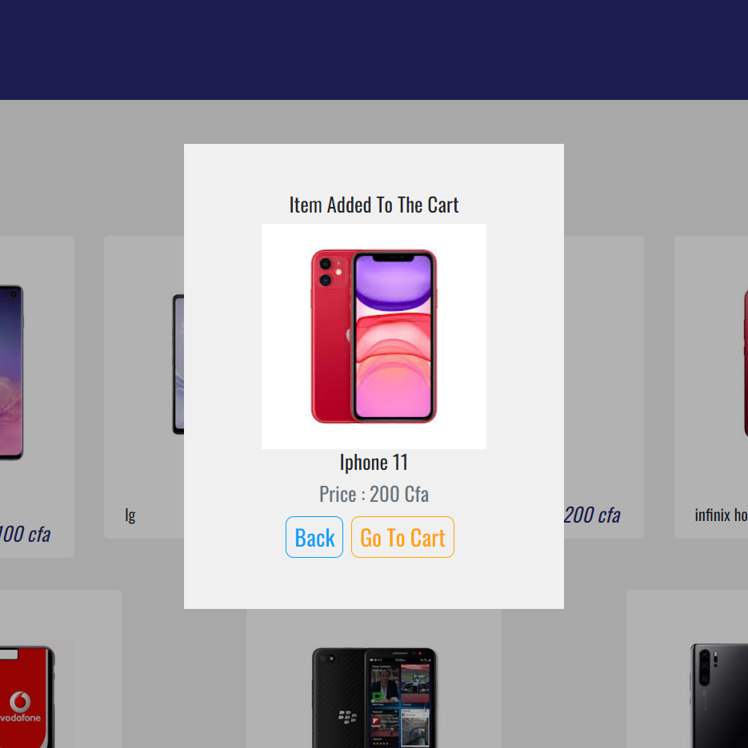
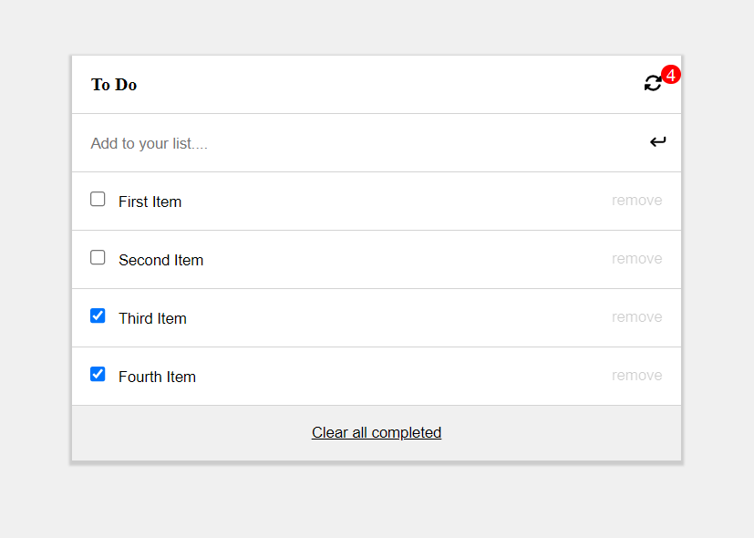

  <h1> Hi, I'm Musong Ernest! </h1>

<p><em>Remote Full-stack web developer ready for adventure</em></p>
<div id="badges"align="left">
<a href="https://www.linkedin.com/in/musong-ernest-akeh-921b73211/">

</a>
<a href="https://github.com/ernestmusong">

</a>
<a href="https://twitter.com/MusongAkeh">

</a>
</div>
</h1>
              
 

##  More about me...  

```javascript
const musong = {
  lookingFor: "Front-end developer" || "Full-stack web developer",
  pronouns: ["she", "her"],
  code: [JavaScript, React, Redux, Rails, SQL, mongoDB],
  otherSkills: [WordPress, SEO, Web hosting],
  challenge: "Eager to contribute to open source",
  funFacts: ['I am currently completing course work at Microverse', 
  'At Microverse, we do pair-programming everyday']
}
```

### :hammer_and_wrench: Languages and Tools :
<div>
&nbsp;
&nbsp;

&nbsp;
&nbsp;
&nbsp;


 
</div>


### :hammer_and_wrench: Other Skills :
<div>
  &nbsp;
  &nbsp;
</div>


###  Some of my awesome projects... 

 
 <a href='https://musong-e-store.netlify.app/' ></a>
 <a href='https://musong-to-do.netlify.app/' ></a>
 

<p>You can check out my portfolio <a href="https://ernestmusong.github.io/">here</a></p>
