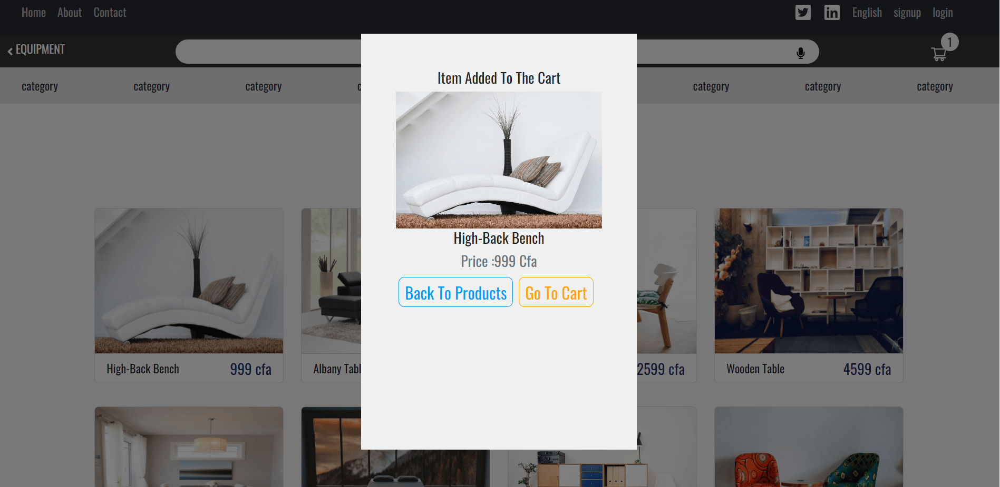
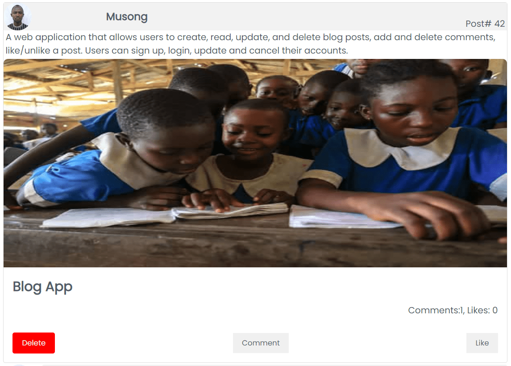
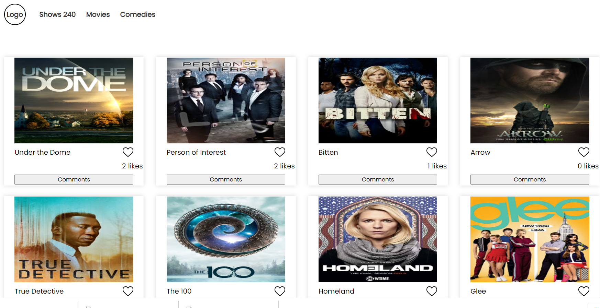
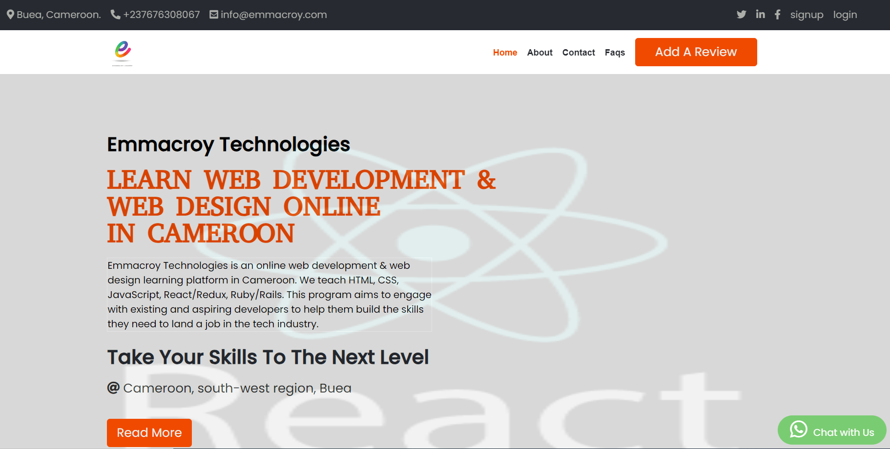
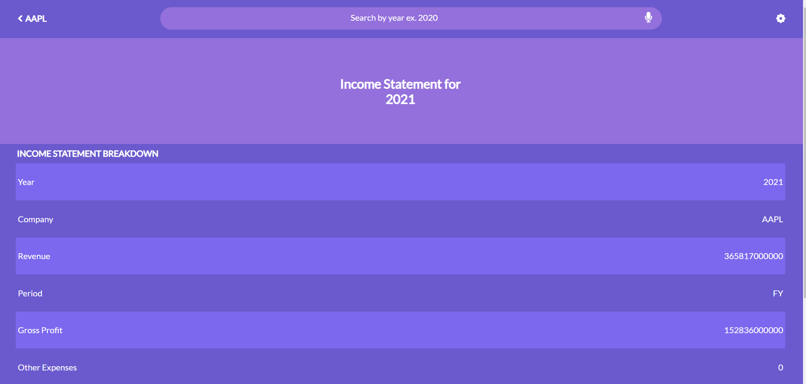
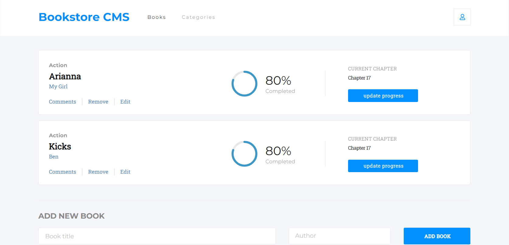

  <h1> Hi, I'm Musong Ernest! </h1>

<p><em>Remote Software developer open to work.</em></p>
<div id="badges"align="left">
<a href="https://www.linkedin.com/in/musongernestakeh/">

</a>
<a href="https://github.com/ernestmusong">

</a>
<a href="https://twitter.com/MusongAkeh">

</a>
  <a href="mailto:ernestakeh@gmail.com">

</a>
</div>
</h1>
              
 

##  More about me...  

```javascript
const musong = {
  Profession: "Software Engineer" || "Full-stack web developer",
  Gender: "Male",
  skills: [JavaScript, React, Redux, Ruby/Rails, Nodejs, Express, SQL, mongoDB, testing],
  otherSkills: [WordPress, SEO, Web hosting],
  Passion: "Pair programming",
  Status: 'Open to work', 
}
```

### :hammer_and_wrench: Languages and Tools :
<div>
&nbsp;
&nbsp;

&nbsp;
&nbsp;
&nbsp;
&nbsp;


 
</div>


### :hammer_and_wrench: Other Skills :
<div>
  &nbsp;
  &nbsp;
  &nbsp;
</div>


<!-- ###  Some of my awesome projects... 

 <div style='display:flex; flex-wrap:wrap;'>
  <a href='https://musong-furniture-store.netlify.app/' ></a>

  > Furniture Store: E-commerce web app built with React/Redux

 <div style='display:flex; flex-wrap:wrap;'>
  <a href='https://becuda.netlify.app/#/' ></a>

  > Cultural website: A Cultural web app built with React/Redux 

  <a href='https://musong-blog-app.onrender.com/' ></a>

  > Blog app: A Blogging web app built with Rails

  <a href='https://musong-tv-shows.netlify.app/' ></a>

  > TVMaze movies: A Movies website built with javaScript/Webpack

  <a href='https://emmacroy.netlify.app/' ></a>

  > Emmacroy Technologies: An Education website built with javaScript

  <a href='https://musong-annual-report.netlify.app/' ></a>

  > Annual income report: A Financial report web app built with React/Redux

  <a href='https://musong-bookstore.netlify.app/'></a>

  > Bookstore: A Bookstore app built with React/Redux
 </div> -->
 

### <p>You can check out my portfolio <a href="https://ernestmusong.github.io/Portfolio/">here</a></p>
